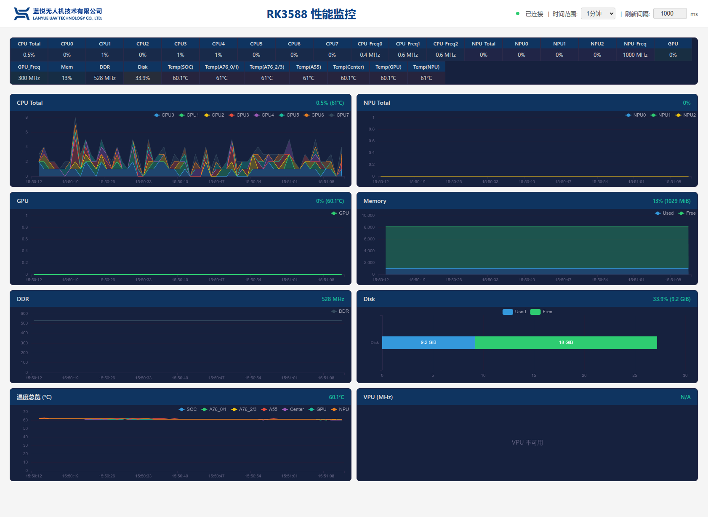

# lanyve_rk_performance - RK3588 性能监控仪表盘

实时监控瑞芯微 RK3588 SoC 各项性能指标的 Web 仪表盘。



## 功能特性

- **实时监控** - 通过 WebSocket 推送数据，支持 500ms ~ 10s 可调刷新间隔
- **多维度采集** - CPU、GPU、NPU、VPU、内存、磁盘、温度、DDR 频率
- **历史图表** - 支持 1/3/5/10 分钟时间范围的历史数据曲线
- **性能模式切换** - 一键切换 CPU/GPU/NPU governor（performance / ondemand）
- **响应式设计** - 适配桌面端和移动端浏览器

## 监控指标

| 模块 | 采集内容 | 数据来源 |
|------|----------|----------|
| CPU | 8 核使用率、3 组簇频率 | `/proc/stat`, sysfs cpufreq |
| GPU | 负载率、频率 | sysfs devfreq |
| NPU | 3 核负载、频率 | debugfs, sysfs devfreq |
| VPU | 编解码器频率 | sysfs devfreq |
| 内存 | 已用/可用/总量 | `/proc/meminfo` |
| 磁盘 | 已用/可用/总量 | `os.statvfs()` |
| 温度 | 各 thermal zone 温度 | sysfs thermal |
| DDR | 当前频率 | sysfs devfreq |

## 快速开始

### 依赖

- Python 3.10+
- RK3588 设备（需运行 Linux 系统）

### 安装

```bash
pip install -r requirements.txt
```

### 启动

```bash
# 建议 sudo 运行以获得完整权限（NPU 负载等需要 root）
sudo python3 main.py
```

启动后访问 `http://<设备IP>:8080`。

### 注意事项

- NPU 负载监控需要 debugfs，如未挂载请执行：
  ```bash
  sudo mount -t debugfs none /sys/kernel/debug
  ```

## API 接口

| 方法 | 路径 | 说明 |
|------|------|------|
| GET | `/` | 主页面 |
| GET | `/api/snapshot` | 获取当前系统快照数据 |
| GET | `/api/performance/status` | 查询当前 governor 状态 |
| POST | `/api/performance/cpu` | 切换 CPU 性能模式 |
| POST | `/api/performance/gpu` | 切换 GPU 性能模式 |
| POST | `/api/performance/npu` | 切换 NPU 性能模式 |
| POST | `/api/performance/all` | 切换全部设备性能模式 |
| WS | `/ws` | WebSocket 实时数据推送 |

## 配置

配置项定义在 `config.py` 中，主要参数：

| 配置项 | 默认值 | 说明 |
|--------|--------|------|
| `SERVER_HOST` | `0.0.0.0` | 监听地址 |
| `SERVER_PORT` | `8080` | 监听端口 |
| `DEFAULT_REFRESH_INTERVAL` | `1000` | 默认刷新间隔（ms） |
| `HISTORY_WINDOW_SIZE` | `60` | 历史数据窗口大小 |
| `CPU_DEFAULT_GOVERNOR` | `ondemand` | CPU 默认 governor |
| `GPU_DEFAULT_GOVERNOR` | `simple_ondemand` | GPU 默认 governor |
| `NPU_DEFAULT_GOVERNOR` | `rknpu_ondemand` | NPU 默认 governor |

## 项目结构

```
.
├── main.py              # 程序入口
├── config.py            # 全局配置
├── requirements.txt     # Python 依赖
├── collectors/          # 数据采集器
│   ├── base.py          # 采集器基类
│   ├── cpu.py           # CPU 采集器
│   ├── gpu.py           # GPU 采集器
│   ├── npu.py           # NPU 采集器
│   ├── vpu.py           # VPU 采集器
│   ├── memory.py        # 内存采集器
│   ├── disk.py          # 磁盘采集器
│   └── thermal.py       # 温度采集器
├── web/                 # Web 服务
│   ├── app.py           # aiohttp 应用工厂
│   ├── websocket.py     # WebSocket 推送引擎
│   └── performance.py   # 性能模式切换 API
└── static/              # 静态资源
    ├── index.html       # 前端主页
    ├── css/style.css    # 样式
    └── js/dashboard.js  # 前端逻辑
```

## 技术栈

- **后端**: Python 3 + aiohttp + asyncio
- **前端**: HTML5 + CSS3 + JavaScript (ES6+) + ECharts 5.5.1
- **数据源**: Linux sysfs / procfs / debugfs

## License

MIT
